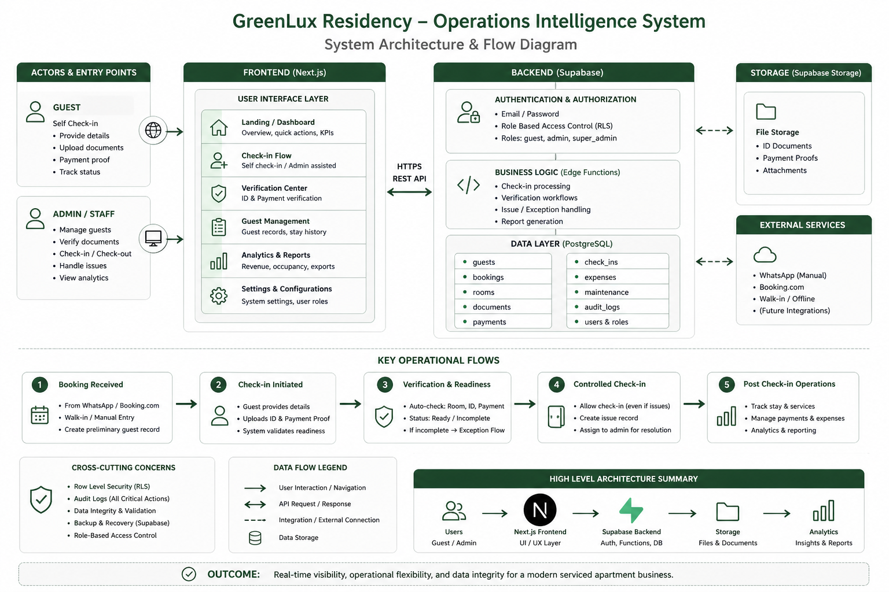

# GreenLux Residency — Operations Intelligence System (MVP v5.9)

A production-grade internal operations platform designed for a real-world serviced accommodation business.

This system replaces fragmented, manual workflows (WhatsApp, spreadsheets, ad-hoc coordination) with a structured, auditable, and action-driven operational layer.

---

## 🧠 Problem Context

GreenLux Residency operates in a high-friction environment:

- Bookings from multiple sources (Booking.com, WhatsApp, walk-ins)
- Non-technical operational staff
- Incomplete or delayed guest data
- Real-time decision-making at check-in

Traditional systems either:
- ❌ Block operations with rigid validation  
- ❌ Or allow chaos with no visibility  

---

## 🎯 Solution Approach

> **Do not block operations — make risk visible and manageable**

Key design principles:

- Enable check-in under imperfect conditions
- Track and surface operational risk explicitly
- Maintain a single source of truth for data
- Prioritise usability for non-technical users
- Preserve auditability for reporting and control

---

## 🧠 System Philosophy

This system does NOT behave like a traditional hotel PMS.

Instead, it enforces:

- Visibility over restriction  
- Flexibility over rigidity  
- Real-world operations over theoretical correctness  

Example:

- Staff can check in guests with missing documents  
- The system surfaces:
  - CNIC pending  
  - Payment proof pending  
  - Outstanding balance  
- These become **actionable issues**, not blockers  

This mirrors how real hotels operate under pressure.

---

## ⚙️ System Capabilities

### 1. Unit-Based Inventory (Phase 5.7)
- 11-unit canonical inventory
- `unit_number` as the operational source of truth
- Unit-level assignment (not category-based)
- Overlap protection (prevents double booking)
- Unit-first analytics (then grouped by category)
- Temporary Unit 8 mapping retained for correction

---

### 2. Live Occupancy Intelligence (Phase 5.8)
- Real-time 11-unit occupancy board  
- Status types:
  - Occupied  
  - Vacant  
  - Due Out Today  
  - Reserved / Upcoming  
  - Maintenance  
  - Needs Attention  

Unit-level visibility:
- Guest details (current / upcoming)
- Verification state (CNIC, payment)
- Outstanding balances (including folio)
- Issue / exception flags
- Maintenance state

Integrated into:
- `/admin/occupancy`
- Admin dashboard summary
- Reports layer

---

### 3. Daily Operations Command Centre (Phase 5.9)

Primary route:
`/admin/command-centre`

This is the **daily control screen for staff**.

Instead of showing raw data, it shows:

#### Immediate Actions
- Check-outs due today
- Check-ins without assigned unit
- Pending CNIC / payment verification
- Outstanding balances
- Maintenance issues
- Missing checkout dates

#### Today’s Operations
- Arrivals
- Departures
- Current in-house guests

#### Unit Snapshot
- Occupied / vacant / maintenance state

#### Money Snapshot
- Today’s collected (derived)
- Outstanding balances
- New charges

#### Quick Actions
- New guest
- Assign unit
- Extend stay
- Add charges (folio)
- Mark payment

**Critical Design Rule:**
- No new workflows
- No duplication of logic
- Only orchestration of existing system truth

---

### Guest Operations
- Self-service and admin-assisted check-in
- Walk-in and WhatsApp booking handling
- Room/unit assignment and stay lifecycle management

---

### Verification Layer
- CNIC / Passport capture
- Payment proof tracking
- Document status:
  - `pending`
  - `verified`
  - `rejected`

---

### Controlled Override System (Core Feature)
- Automated readiness detection (room, ID, payment)
- Exception-based check-in flow
- Structured issue tracking

→ Operations continue without blocking, while risks remain visible

---

### 🧾 Guest Folio & Additional Charges
- Track services (breakfast, tea, extra mattress, etc.)
- Paid vs unpaid charges
- Included in total revenue and outstanding balance
- Printable receipt-ready structure

---

### 🔁 Extend Stay Workflow
- Extend stay directly from guest record
- Updates expected revenue
- Tracks payment changes
- Adds audit trace

---

### 🔧 Maintenance & Expense Integration
- Maintenance logs (operational truth)
- Expenses (financial truth)
- Linked without double counting

---

### 📊 Analytics & Reporting
- Revenue (expected vs paid)
- Outstanding balances
- Booking source breakdown
- Unit-level performance
- New vs repeat guests
- CSV export

---

### 🔐 Role-Based Access Control
- Manager: operational access
- Admin: extended operations
- Super Admin: full control

---

## 🏗️ System Architecture

This system prioritises:
- flexibility over rigid workflows
- auditability over restriction
- admin control under operational pressure

---

## 🔄 Operational Transformation

### Before

- WhatsApp-based coordination  
- No structured records  
- Manual check-in  
- Missing ID/payment tracking  
- No financial visibility  

### After

- Centralised system of record  
- Structured check-in workflows  
- Verification tracking  
- Unit-level operational visibility  
- Real-time occupancy intelligence  
- Action-driven command centre  
- Full guest folio tracking  

---

## ⚠️ Real-World Trade-offs

This system intentionally:

- Does **not block check-in** due to missing data  
- Avoids premature complexity (no booking engine yet)  
- Favors **operational continuity over theoretical correctness**

Instead, it enforces:

- Visibility of risk  
- Structured recovery workflows  
- Clean data for analytics  

---

## ⚠️ Known Limitations

- “Today’s collected” is derived from reporting logic  
- No dedicated base-payment timestamp in schema  
- Folio charges use `guest_charges.charged_at`  
- Financial granularity can be improved in future phases  

---

## 🚀 What This Demonstrates

- Real-world system design under operational constraints  
- Translating messy operations into structured systems  
- Building for non-technical users  
- Balancing flexibility with data integrity  
- Product thinking over pure engineering  

---

## 📌 Status

**Production MVP — Phase 5.9 (Command Centre + Live Operations Intelligence)**

Recent upgrades:

- Phase 5.7 — Unit-based inventory system  
- Phase 5.8 — Live occupancy intelligence layer  
- Phase 5.9 — Daily operations command centre  
- Unit-level analytics and reporting  
- Guest folio and service tracking  
- Extend stay workflow  
- Maintenance and expense integration  
- Role-based access control  

Built and iterated against real-world hospitality operations.

---

## 📍 Deployment

Internal Operations System:  
https://greenlux-ops.vercel.app/admin  

Command Centre:  
https://greenlux-ops.vercel.app/admin/command-centre  

Occupancy Board:  
https://greenlux-ops.vercel.app/admin/occupancy  

Guest Check-in:  
https://greenlux-ops.vercel.app/dashboard/check-in  

Public Website:  
https://greenluxresidency.com  

---

## 👤 Author

Mustafa Chaudry  
MSc Computer Science (Artificial Intelligence)  
Sheffield, UK  