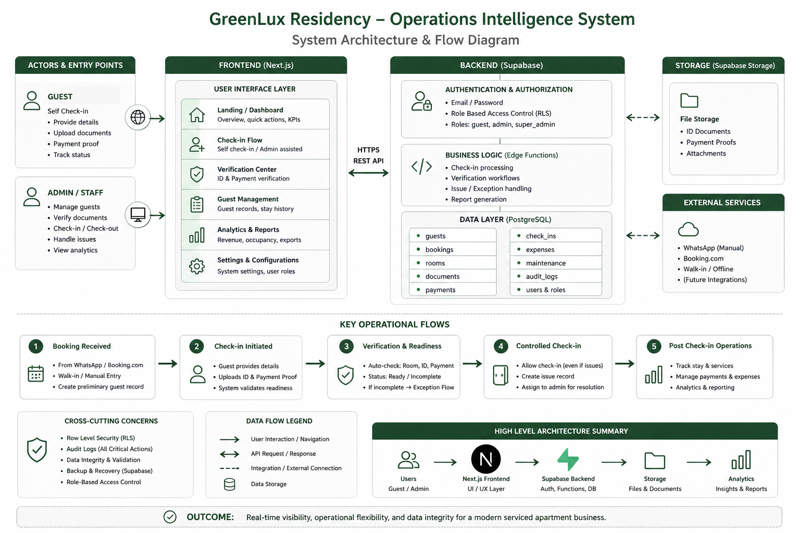

# GreenLux Residency - Operations Intelligence System

A production-grade operations and public conversion platform designed for a real serviced accommodation business.

GreenLux Ops replaces fragmented, manual workflows - WhatsApp coordination, spreadsheets, ad-hoc guest records, scattered payment tracking, informal room handovers, and disconnected public enquiries - with a structured, auditable, action-driven system for a boutique serviced accommodation business in Rawalpindi / Islamabad.

The platform now covers two connected surfaces:

- An internal operations system for staff, managers, and owners.
- A public website and guest-facing conversion layer for room discovery, local guides, WhatsApp enquiries, and arrival preparation.

**Status:** Production MVP - Phase 7.0 + Public Conversion System v1
**Core principle:** Do not block operations. Make risk visible and manageable.

---

## Problem Context

GreenLux Residency operates in a high-friction hospitality environment:

- Bookings arrive from WhatsApp, walk-ins, Booking.com, Airbnb, Agoda, agents, and direct calls.
- Guests may be repeat visitors, families, corporate visitors, medical visitors, tourists, or one lead guest booking multiple rooms.
- Front-desk staff are non-technical and work under real check-in pressure.
- Guest data, ID documents, payment confirmation, and room details may arrive late or incomplete.
- Public visitors need room clarity, local confidence, pricing, and a direct way to speak to GreenLux before they book.
- Confirmed guests need clear arrival instructions without exposing private access details or internal operational language.

Traditional systems often fail in this environment because they either:

- Block operations with rigid validation, or
- Allow chaos with no structured visibility.

GreenLux Ops is designed for the middle path: operational flexibility with visible risk, auditability, recovery, and a guest-facing website that supports the real business instead of acting like a generic hotel template.

---

## Solution Philosophy

> **Do not block operations - make risk visible and manageable.**

GreenLux Ops is not a traditional hotel PMS. It is an operational intelligence layer for a real serviced accommodation business, with a public conversion layer built around the same operational truth.

The system prioritises:

- Visibility over restriction
- Admin-controlled recovery over fragile automation
- Room/stay-level truth over vague booking summaries
- Non-technical usability over technical purity
- Premium hospitality language over generic system jargon
- Auditability where corrections affect financial or operational truth
- Public website content that helps guests choose, plan, and contact GreenLux with less friction

Example:

- Staff can create a Guest Stay even when some information is incomplete.
- The system surfaces risks such as ID pending, Payment Confirmation pending, Balance Due, room not ready, or missing supporting documents.
- Public room and guide pages steer visitors toward useful WhatsApp enquiries instead of forcing an unfinished booking-engine flow.

This mirrors how real hotels operate under pressure while still improving data integrity and guest confidence.

---

## What GreenLux Ops Is

GreenLux Ops is a structured platform for:

- Guest Stay records
- Guest check-in and front-desk entry
- Repeat guest intelligence
- ID, payment, and supporting document tracking
- Room/unit assignment and readiness
- Lead Booking / multi-room responsibility workflows
- Receipts for accommodation and reimbursement
- Owner-grade business analytics
- Super-admin correction and audit recovery
- Public room discovery and website conversion support
- Local SEO guides for Rawalpindi, Islamabad, nearby hospitals, food, parks, travel, and airport planning
- Guest-facing arrival preparation before protected online check-in

It is intentionally not yet:

- A full booking engine
- A channel manager
- An accounting system
- A payment-date ledger
- An automated WhatsApp agent

---

## Core System Capabilities

### 1. Guest Stay Operations

GreenLux uses **Guest Stays** as the operational source of truth for individual room stays.

Current capabilities include:

- Self-service guest check-in through `/dashboard/check-in`
- Admin/front-desk Add Guest Stay workflow
- Walk-in and WhatsApp booking handling
- Agent booking source support
- Primary guest ID/passport uploads
- Additional guest ID/passport uploads
- Supporting documents for marriage certificates, authorization letters, company letters, or other supporting material
- Camera-friendly upload inputs where supported by the device/browser
- Payment Confirmation tracking
- Payment coverage / follow-up visibility
- Repeat guest autofill from previous stays
- Previous ID/supporting documents reused into new stays where appropriate
- Old payment proof excluded from reuse because payment confirmation is stay-specific

---

### 2. Room Reality Board

Route: `/admin/occupancy`

The Room Reality Board gives staff a fast operational view of all units.

It shows:

- Occupied / vacant / due-out / upcoming status
- Room/unit assignment
- Guest context
- Stay period and nights
- ID Verification state
- Payment Confirmation state
- Balance Due
- Room readiness and cleaning state
- Maintenance blocked rooms
- Multi-room booking context where relevant

The design goal is high-density, low-stress operational clarity.

---

### 3. Command Centre

Route: `/admin/command-centre`

The Command Centre is the daily manager screen.

It displays:

- Arrivals today
- Departures today
- Rooms needing cleaning
- Rooms not ready
- Maintenance blocked rooms
- Balance Due
- Pending ID / Payment Confirmation
- Multi-room booking attention
- Priority actions ordered by operational urgency

The Command Centre does not create new workflows. It orchestrates existing system truth into a daily action view.

---

### 4. Guest Stay Workspace

Route: `/admin/guest-records/[id]`

The Guest Stay detail page is the operational control panel for an individual room stay.

It includes:

- Top operational summary
- Priority alerts / Needs Attention
- Action panel
- Guest Stay details
- Payment & Charges
- Documents / ID Verification
- Supporting document uploads
- Guest Messages / WhatsApp actions
- Receipt actions
- Repeat Guest / Stay History
- Admin controls
- Super-admin correction console where authorised

The page is designed so staff can understand the current operational risk in under 10 seconds.

---

### 5. Verification Layer

- CNIC / passport capture
- Payment proof tracking
- Document status:
  - `pending`
  - `verified`
  - `rejected`

---

### 6. Controlled Override System

- Automated readiness detection across room, ID, and payment status
- Exception-based check-in flow
- Structured issue tracking
- Operational recovery without silent database edits

Operations continue without blocking, while risks remain visible.

---

### 7. Guest Folio & Additional Charges

- Track services such as breakfast, tea, extra mattress, and other stay charges
- Paid vs unpaid charge visibility
- Included in total revenue and outstanding balance
- Receipt-ready structure

---

### 8. Extend Stay Workflow

- Extend stay directly from the guest record
- Update expected revenue
- Track payment changes
- Add audit trace

---

### 9. Maintenance & Expense Integration

- Maintenance logs capture operational truth
- Expenses capture financial truth
- The two are linked without double counting

---

### 10. Repeat Guest Intelligence

GreenLux supports returning guests without forcing them to re-enter details or reupload documents unnecessarily.

Staff can:

- Search previous guests by name, phone, CNIC/passport, or email
- See previous stay count
- See last stay, last room/unit, booking source, rate/night, document availability, and Balance Due warnings
- Prefill safe reusable details into a new Guest Stay
- Reuse previous ID/supporting documents into the new stay where appropriate
- Keep payment truth, room assignment, dates, and stay-specific verification separate

This is built for the real front-desk reality where many guests are walk-in, WhatsApp-based, or reluctant to self-register.

---

### 11. Lead Booking / Multi-Room Workflow

Route: `/admin/booking-groups/[id]`

GreenLux supports one responsible lead guest/booker managing multiple rooms.

The model is:

- **Lead Booking** = responsible booker / payment and coordination context
- **Guest Stay** = individual room/stay operational and financial truth

A Lead Booking can include rooms with different:

- Dates
- Nights
- Rates
- Occupants
- Payment status
- Balance Due
- Room readiness
- Receipt needs

The Lead Booking workspace shows all linked room stays together while preserving each room's individual truth.

Important financial rule:

> Reports calculate revenue from individual Guest Stays, not Lead Booking reference totals, to avoid double-counting multi-room bookings.

---

### 12. Receipts

GreenLux includes a professional receipt workflow suitable for accommodation records and workplace reimbursement.

Route: `/admin/guest-records/[id]/receipt`

Receipt features:

- Clean printable Receipt layout
- Browser print / Save as PDF workflow
- Receipt reference and issue date
- Stay period and nights
- Rate/night
- Accommodation Charges
- Additional Charges
- Amount Paid
- Balance Due
- Payment method and status

Receipts remain stay-level unless a future combined multi-room receipt is explicitly built.

---

### 13. Business Analytics v2

Route: `/admin/reports`

The analytics layer has moved from simple booking totals to owner-grade business reporting.

Current analytics include:

- Daily / Weekly / Monthly / Custom report modes
- Visible final reporting period
- Room-night overlap allocation
- Expected Revenue
- Paid Revenue Recorded
- Balance Due
- Expenses
- Net Profit
- Booked Room Nights
- Occupancy
- Average Rate / Night
- Daily Performance
- Unit Performance
- Unit Type Performance
- Booking Source Performance
- Risk & Recovery / Attention Needed
- Supporting Detail
- CSV/export support where available

The report is designed to answer:

1. Are we making money?
2. Are rooms being used well?
3. Where is money coming from?
4. Which days performed well or badly?
5. What is leaking or unpaid?
6. What should we do next?

Important limitation:

**Paid Revenue Recorded** is based on recorded paid amounts. GreenLux does not yet have payment-date ledger accounting.

---

### 14. Super Admin Correction Console

Phase 7.0 adds controlled recovery for real-world data mistakes.

Super admins can correct key Guest Stay data from inside the platform, including:

- Guest identity and contact fields
- Stay dates
- Assigned room
- Booking source
- Guest count
- Stay status
- Payment status and method
- Agreed room rate
- Total expected amount
- Amount paid
- ID Verification / Payment Confirmation flags
- Internal notes
- Lead Booking context

Corrections require a reason and are audit logged with old/new values where supported by the existing audit log structure.

This avoids silent database editing while still allowing real operational recovery.

---

### 15. Public Conversion System v1

GreenLux now has a public website layer designed to support direct booking enquiries, local SEO, and guest confidence before arrival.

Current public surfaces include:

- Homepage `/` with rotating property hero, room highlights, trust cues, shared spaces, stay planning, FAQ, and WhatsApp CTAs
- Rooms `/rooms` and room detail pages with real room assets, current pricing, capacity, amenities, and room-specific WhatsApp prompts
- Location `/location` with Westridge 1 positioning, nearby essentials, airport planning, hospitals, parks, food, and city access
- Guides `/guides` and `/guides/[slug]` for local stay-planning topics such as nearby hospitals, food, Race Course Park, Rawalpindi/Islamabad access, international guest tips, Murree/Nathia Gali, northern areas onward travel, and Islamabad airport planning
- Arrival `/arrival` for confirmed or soon-to-arrive guests, positioned before the protected online check-in route
- Contact `/contact` with structured enquiry details for dates, guest count, visit purpose, arrival timing, and WhatsApp follow-up

SEO and conversion foundations include:

- Sitemap generation through `src/app/sitemap.ts`
- Robots rules through `src/app/robots.ts`, including blocked admin/auth/dashboard/design-preview routes
- Centralised metadata and structured-data helpers in `src/lib/site/seo.ts`
- Public content sources in `src/lib/site/rooms.ts`, `src/lib/site/guides.ts`, `src/lib/site/content.ts`, `src/lib/site/trust.ts`, and `src/lib/site/config.ts`
- Guest-safe copy rules: no private access details, no Wi-Fi password exposure, no admin-only wording on public pages
- Preview discipline: experimental design routes stay unlinked and ignored until their purpose, copy, and design are approved

This work deliberately kept the approved homepage direction instead of replacing it with an unproven funnel. The current public strategy is to improve discoverability, local confidence, room comparison, and direct WhatsApp enquiries around the existing brand experience.

---

## Data Truth Model

GreenLux separates responsibility, room-level truth, documents, public content, and financial reporting.

Core tables include:

- `users_profile` - user roles and access context
- `rooms` - unit inventory and readiness state
- `guest_checkins` - room/stay-level operational and financial truth
- `guest_documents` - ID, payment, and supporting documents
- `guest_charges` - additional stay charges
- `expenses` - business expense truth
- `room_maintenance_logs` - operational maintenance records
- `booking_groups` - Lead Booking / responsible booker context
- `audit_logs` - correction and operational audit trail

Key rules:

- Guest Stays are the source of financial truth.
- Lead Bookings are responsibility and coordination context.
- Payment confirmation is stay-specific.
- Previous ID/supporting documents may be reused for repeat guests.
- Previous payment proof is not reused for a new stay.
- Reports use individual Guest Stays to avoid double-counting multi-room bookings.
- Public website content is config-driven and must not expose guest documents, payment proof, private receipt links, or operational credentials.

---

## System Architecture



The system is built with:

- Next.js App Router
- TypeScript
- Tailwind CSS
- Supabase Postgres
- Supabase Auth
- Supabase Storage
- Row Level Security
- Private signed URL document access
- Vercel deployment
- Public SEO routes for sitemap, robots, metadata, and structured data

Role-based access includes:

- Manager: operational access
- Admin: extended operations
- Super Admin: correction and full recovery control

---

## Operational Transformation

### Before

- WhatsApp-based coordination
- Repeated guest data entry
- Informal document collection
- Manual room tracking
- Unclear responsibility for management and staff
- Payment follow-up handled from memory
- Limited owner-level reporting
- Mistake correction through manual database intervention
- Public website content that did not fully support local search, room comparison, arrival preparation, or structured direct enquiries

### After

- Centralised Guest Stay records
- Front-desk and self-service check-in workflows
- Repeat guest intelligence
- Previous documents reused safely where appropriate
- Lead Booking workspace for multi-room responsible bookers
- Room Reality Board
- Daily Command Centre
- Professional receipts
- Owner-grade analytics
- Super-admin correction with audit trail
- Public room discovery with real room assets, pricing, and enquiry prompts
- Local guide pages that connect Rawalpindi/Islamabad visitor intent to GreenLux rooms and WhatsApp support
- Guest-facing arrival guide that helps confirmed guests prepare without exposing private details

---

## Real-World Trade-offs

This system intentionally:

- Does not block check-in because some data is incomplete
- Avoids premature booking-engine complexity
- Avoids automatic WhatsApp sending for now
- Keeps payment confirmation stay-specific
- Keeps Lead Booking totals out of revenue truth
- Uses browser PDF printing before adding PDF libraries
- Prioritises operational continuity over theoretical perfection
- Keeps public design experiments out of live navigation until they are approved

Instead, it enforces:

- Risk visibility
- Staff follow-up
- Admin recovery
- Financial clarity
- Auditability where corrections matter
- Guest-facing clarity where public trust and conversion matter

---

## Known Limitations / Future Work

Not yet built:

- Full booking engine
- Channel manager integration
- Automatic WhatsApp sending
- Payment ledger / payment-date accounting
- Combined multi-room receipt
- Cleaner role and inspection module
- Lost property register
- Historical Booking.com / Airbnb / Agoda imports
- Tax invoice / accounting system
- Public conversion analytics and event tracking
- Approved ad-landing pages for specific campaigns
- Fully optimised production logo and complete brand asset system

Likely next phases:

- Cleaner Role + Housekeeping Inspection
- Lost Property Register
- Historical Booking Imports
- Payment Ledger
- Combined Multi-Room Receipt
- Public conversion measurement for WhatsApp CTAs, guide pages, room pages, and campaign traffic
- Approved arrival concierge or ad-landing pages only after their business role is clear

---

## What This Demonstrates

- Real-world product engineering under operational pressure
- Translating messy hospitality workflows into structured systems
- Building for non-technical users without hiding operational risk
- Data truth modelling for room-level revenue, documents, lead bookings, receipts, and reporting
- Full-stack delivery across Next.js, TypeScript, Supabase, RLS, Storage, admin workflows, public pages, and Vercel deployment
- Public conversion thinking that connects SEO, local content, room discovery, WhatsApp intent, and guest arrival preparation
- Financial and reporting caution, including explicit double-counting protection for multi-room bookings
- Portfolio-grade judgement: useful automation where it helps, manual recovery where the business still needs human control

---

## Validation / Developer Notes

Standard validation commands:

```bash
npm run typecheck
npm run lint
npm run build
git diff --check
```

Feature validators currently used across the project include:

```bash
node scripts/validate-room-reality-board.mjs
node scripts/validate-cleaning-turnover-layer.mjs
node scripts/validate-phase-6-4-multi-room-bookings.mjs
node scripts/validate-phase-6-5-accommodation-receipt.mjs
node scripts/validate-command-centre.mjs
node scripts/validate-guest-portal-concierge.mjs
node scripts/validate-guest-record-detail-v2.mjs
node scripts/validate-front-desk-entry-fixes.mjs
node scripts/validate-repeat-guest-intelligence.mjs
node scripts/validate-lead-booking-workspace.mjs
node scripts/validate-business-analytics-v2.mjs
node scripts/validate-super-admin-corrections.mjs
```

Deployment discipline:

- Apply Supabase migrations before deploying code that depends on new tables, columns, or enum values.
- Do not deploy schema-dependent code before the database is ready.
- Do not accidentally commit manual reset/test cleanup scripts.
- Do not commit large raw assets unless intentionally optimised and used.
- Keep experimental `src/app/design-preview/**` work unlinked and out of live commits until approved.
- Public guest pages must not expose Wi-Fi passwords, private access details, document URLs, payment proof, or admin-only links.

---

## Deployment

Internal Operations System:  
https://greenlux-ops.vercel.app/admin

Command Centre:  
https://greenlux-ops.vercel.app/admin/command-centre

Room Reality Board:  
https://greenlux-ops.vercel.app/admin/occupancy

Add Guest Stay:  
https://greenlux-ops.vercel.app/admin/guests/new

Guest Stays:  
https://greenlux-ops.vercel.app/admin/guest-records

Business Analytics:  
https://greenlux-ops.vercel.app/admin/reports

Guest Check-in:  
https://greenlux-ops.vercel.app/dashboard/check-in

Public Website:  
https://greenluxresidency.com

Rooms:
https://greenluxresidency.com/rooms

Location:
https://greenluxresidency.com/location

Guides:
https://greenluxresidency.com/guides

Arrival Guide:
https://greenluxresidency.com/arrival

---

## Status

**Production MVP - Phase 7.0 + Public Conversion System v1**

Built and iterated against real GreenLux Residency operational workflows.

The system now covers guest stay operations, repeat guest handling, lead booking responsibility, room reality, command-centre operations, receipts, business analytics, super-admin correction, public room discovery, local SEO guides, structured WhatsApp enquiry paths, and guest-facing arrival preparation.

---

## Author

Mustafa Chaudry  
MSc Computer Science (Artificial Intelligence)  
Sheffield, UK
